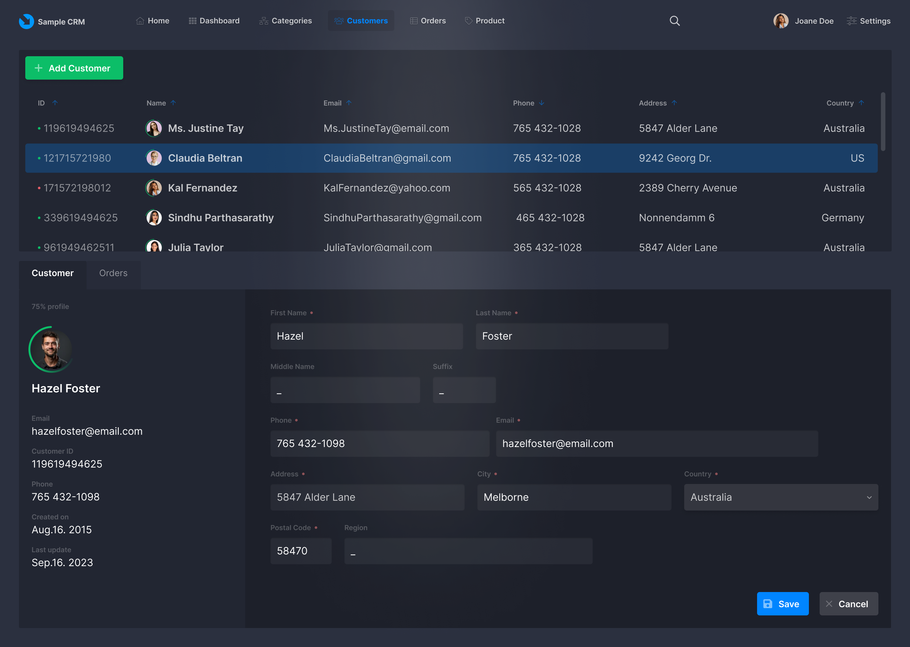
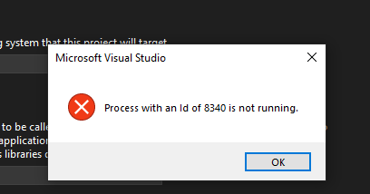
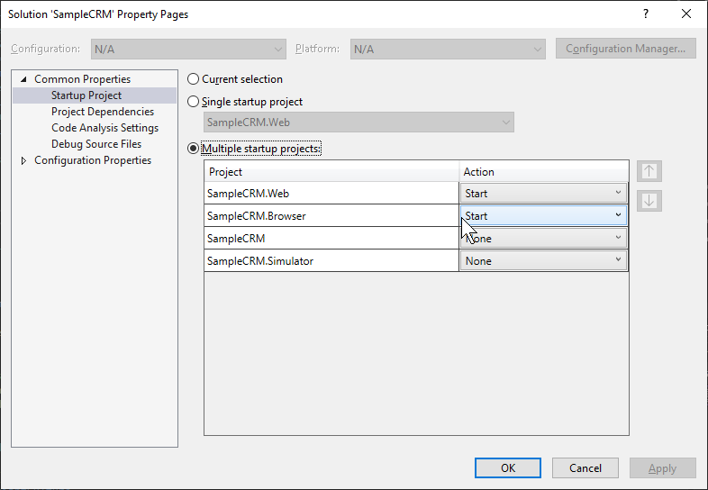
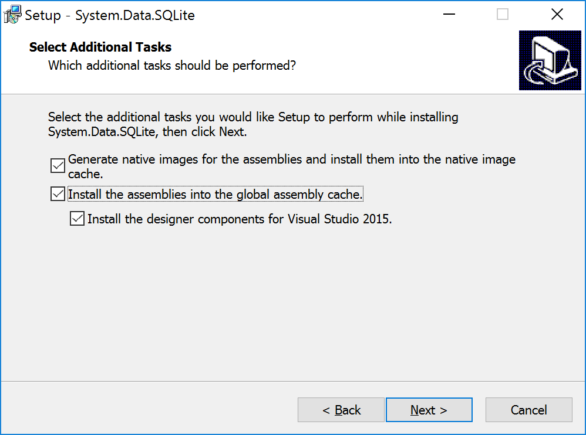
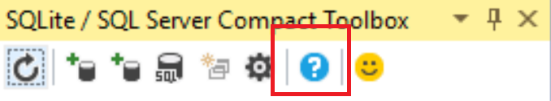

# SampleCRM
**SampleCRM** is a **OpenSilver** / Open RIA Services Business Application Template Demo Application. This application is a guidance how to implement RIA Domain Services, CRUD Operations over SQLite database along with XAML UI. 

## Screenshot


## Database Diagram


## Troubleshoot
If this error is happening please install the latest version of the ASP.NET Core Hosting Bundle, available from Microsoft at: https://dotnet.microsoft.com/permalink/dotnetcore-current-windows-runtime-bundle-installer


For production deployment to public servers please change the following **Developer** Key in the **web.config** to **False**. For development and local deployment purpose this value is **True** in default. When this value has been set to **False** the write access of the database is blocked by RIA Service Layer and prevents users changes any data.
```xml
....
  <appSettings>
    <add key="ReadOnlyMode" value="True" />
  </appSettings>
...
```


## Run & Test
To test it, you need to run simultaneously the **.Web** project and the **.Browser** project


## How To Setup Sqlite Providers for Visual Studio 2022

This section is **optional** for only generate EDMX files via ADO.NET. This section is **NOT** neccesary to run this example.

### EF6 workflow with SQLite DDEX provider
The System.Data.SQLite DDEX provider does not support Visual Studio 2017 and 2019. This post describes how to work with SQLite and Entity Framework 6 in Visual Studio 2017/2019/2022, using the "SQLite Toolbox" DDEX provider for EF6. Notice that this provider only supports the EF 6 Tools, and not other Data Source scenarios, for example Typed DataSets. This requires Visual Studio 2017 15.8 or later.

**Notice special instructions for VS 2022, since it is a 64 bit application**

-   Install Toolbox
-   Install SQLite in GAC
-   Install SQLite EF provider in project
-   Run EDM Wizard
- 
### Install latest Toolbox

Once per Visual Studio edition (daily build at  [https://github.com/ErikEJ/SqlCeToolbox/wiki/Release-notes](https://github.com/ErikEJ/SqlCeToolbox/wiki/Release-notes)  )


### Install SQLite in GAC

Once per machine. Download the latest sqlite-netFx46-setup-bundle-x86-2015-1.0.xxx.0.exe (from  [https://system.data.sqlite.org/index.html/images/trunk/www/downloads-unsup.wiki](https://system.data.sqlite.org/index.html/images/trunk/www/downloads-unsup.wiki))
Select "Full Installation"
Select: Install the assemblies into the global assembly cache - Install VS designer components


**Restart Visual Studio**

Verify that the EF6 provider is installed in GAC from the Toolbox "About" dialog:




If the EF6 provider is not in GAC, this may be due to an invalid entry in machine.config, located in the C:\WINDOWS\Microsoft.NET\Framework\v4.0.30319\Config folder.

_**VS 2022**_  Copy the entry to the 64 bit machince.config located in C:\WINDOWS\Microsoft.NET\Framework64\v4.0.30319\Config

The only SQLite related entry should look like this, with a version number  **matching the download version number**  (in this example .117):

```xml
<system.data>
    <DbProviderFactories> 
        <add name="SQLite Data Provider" 
             invariant="System.Data.SQLite.EF6" 
             description=".NET Framework Data Provider for SQLite" 
             type="System.Data.SQLite.EF6.SQLiteProviderFactory, 
                    System.Data.SQLite.EF6, 
                    Version=1.0.118.0, 
                    Culture=neutral, 
                    PublicKeyToken=db937bc2d44ff139" 
        />  
    </DbProviderFactories> 
</system.data>
```

**Build project!**

### Run Entity Data Model Wizard

Add, New Item, Data, ADO.NET Entity Data Model. Choose "EF Designer from Database" or "Code First from Database"

Use "SQLite Provider (Simple for EF6 by ErikEJ)" when creating a connection to your SQLite database file. Enter the full path to your database file in Data Source.


### Entity Framework does not generate [Key]
Unfortunately, Entity Framework does not generate Key Attribute for Sqlite Provider sometimes. If this has happened in your case too.
You may try to change code of the .tt generation template and add attributes to classes at time of generation. In your case you may change the method for properties generation like that:

```css
public string Property(EdmProperty edmProperty)
{
    return string.Format(
        CultureInfo.InvariantCulture,

        //Custom check for key field
        (_ef.IsKey(edmProperty) ? "[Key]" : "") +

        "{0} {1} {2} {{ {3}get; {4}set; }}",
        Accessibility.ForProperty(edmProperty),
        _typeMapper.GetTypeName(edmProperty.TypeUsage),
        _code.Escape(edmProperty),
        _code.SpaceAfter(Accessibility.ForGetter(edmProperty)),
        _code.SpaceAfter(Accessibility.ForSetter(edmProperty)));
}
```
and add namespace declaration to each generated class:
```csharp
public string UsingDirectives(bool inHeader, bool includeCollections = true)
{
    return inHeader == string.IsNullOrEmpty(_code.VsNamespaceSuggestion())
        ? string.Format(
            CultureInfo.InvariantCulture,

            //Namespace for KeyAttribute goes here
            "{0}using System; using System.ComponentModel.DataAnnotations;{1}" +
            "{2}",
            inHeader ? Environment.NewLine : "",
            includeCollections ? (Environment.NewLine + "using System.Collections.Generic;") : "",
            inHeader ? "" : Environment.NewLine)
        : "";
}
```
Once it done you can click right button on .tt and select "Run custom tool"

## Credits 
This app was inspired by the **InventorySample** app: https://github.com/microsoft/InventorySample (Note: the implementation is very different because it uses RIA Services)
